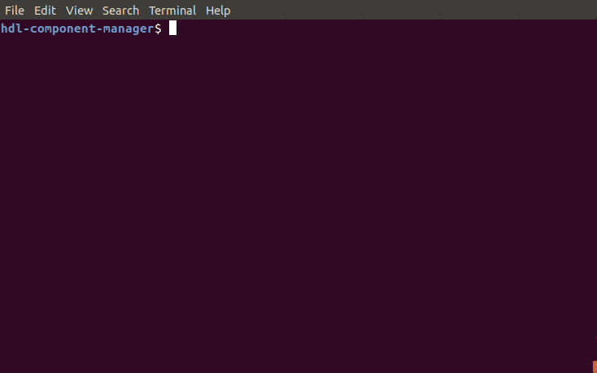

HDL Component Manager (HCM)
===========================

Manage HDL code as components so they can shared as IP.

.. image:: https://img.shields.io/github/tag/jeremiah-c-leary/hdl-component-manager.svg?style=flat-square
   :target: https://github.com/jeremiah-c-leary/hdl-component-manager
   :alt: Github Release
.. image:: https://img.shields.io/pypi/v/hcm.svg?style=flat-square
   :target: https://pypi.python.org/pypi/hcm
   :alt: PyPI Version
.. image:: https://img.shields.io/travis/jeremiah-c-leary/hdl-component-manager/master.svg?style=flat-square
   :target: https://travis-ci.org/jeremiah-c-leary/hcm-component-manager
   :alt: Build Status
.. image:: https://img.shields.io/codecov/c/github/jeremiah-c-leary/hdl-component-manager/master.svg?style=flat-square
   :target: https://codecov.io/github/jeremiah-c-leary/hdl-component-manager
   :alt: Test Coverage
.. image:: https://img.shields.io/readthedocs/vsg.svg?style=flat-square
   :target: http://hdl-component-manager.readthedocs.io/en/latest/index.html
   :alt: Read The Docs
.. image:: https://api.codacy.com/project/badge/Grade/42744dca97544824b93cfc99e8030063
   :target: https://www.codacy.com/app/jeremiah-c-leary/hdl-component-manager?utm_source=github.com&amp;utm_medium=referral&amp;utm_content=jeremiah-c-leary/hdl-component-manager&amp;utm_campaign=Badge_Grade
   :alt: Codacy
.. image:: https://api.codeclimate.com/v1/badges/97a72b806d6919dbcfa9/maintainability
   :target: https://codeclimate.com/github/jeremiah-c-leary/hdl-component-manager/maintainability
   :alt: Maintainability

Table of Contents
-----------------

*   `Overview`_
*   `Key Benefits`_
*   `Key Features`_
*   `Installation`_
*   `Usage`_
*   `Documentation`_
*   `Contributing`_

Overview
--------

HCM was created after a frustrating attempt to merge changes from one program to another.
Even after carefully performing the merge, there were issues.

It was turning into a nightmare just to pass updates between multiple concurrently running programs.
I was inspired by PIP, and how easy it is to install python packages.
I wanted to bring that same level of ease to HDL design.

Key Benefits
------------

*   Provides a method to control versions of IP
*   Controls the distribution of HDL code
*   Follows the Major.Minor.Patch method of version control
*   Language independent (VHDL, Verilog, System Verilog)
*   Can be used to control vendor IP

Key Features
------------

*   Works with SVN repositories
*   Automates publishing of code to a central location
*   Automates installing and upgrading of code
*   Supports multiple IP repositories
*   Supports dependencies between components

Installation
------------

You can get the latest released version of HCM via **pip**.

.. code-block:: bash

   pip install hcm

The latest development version can be cloned...

.. code-block:: bash

  git clone https://github.com/jeremiah-c-leary/hdl-component-manager.git

...and then installed locally...

.. code-block:: bash

  python setup.py install

Usage
-----

HCM can be invoked by issuing **hcm** at the command line prompt:

.. code-block:: bash

    $ hcm
    usage: hcm [-h]
               {browse,create,download,install,uninstall,list,publish,show,validate,version}
               ...
    
    Provides configuration management for HDL components.
    
    positional arguments:
      {browse,create,download,install,uninstall,list,publish,show,validate,version}
        browse              List components available for installation.
        create              Creates a component repo
        download            Downloads components without installing them.
        install             Adds a component from the component repo
        uninstall           Removes installed components
        list                Lists components and their versions
        publish             Adds components to the component repo
        show                Displays information about installed components
        validate            Verifies manifest of installed component
        version             Displays HCM version information
    
    optional arguments:
      -h, --help            show this help message and exit

HCM has eight subcommands:  browse, create, install, uninstall, list, publish, show, and validate.

browse
~~~~~~

Use the **browse** subcommand to list components available for installation.

The arguments for the subcommand can be listed using the *-h* option:

.. code-block:: bash

    $ hcm browse -h
    usage: hcm browse [-h] [component]
    
    positional arguments:
      component   Component to browse
    
    optional arguments:
      -h, --help  show this help message and exit

create
~~~~~~

Use the **create** subcommand to create a component directory in the repository.

The arguments for the subcommand can be listed using the *-h* option:

.. code-block:: bash

    $ hcm create -h
    usage: hcm create [-h] url
    
    positional arguments:
      url         location to create the base component repo
    
    optional arguments:
      -h, --help  show this help message and exit

download
~~~~~~~~

Use the **download** subcommand to pull a version from the repository without installing it.

install
~~~~~~~

Use the **install** subcommand to add or upgrade a component from a repository.

The arguments for the subcommand can be listed using the *-h* option:

.. code-block:: bash

    $ bin/hcm install -h
    usage: hcm install [-h] [--version VERSION] [--url URL] [--force] [--external]
                       [--dependencies] [--upgrade]
                       component
    
    positional arguments:
      component          Component name to install
    
    optional arguments:
      -h, --help         show this help message and exit
      --version VERSION  Major.Minor.Patch version of component to install.
      --url URL          location of component directory in repo
      --force            Install component ignoring any local changes
      --external         Install as an external
      --dependencies     Install dependencies
      --upgrade          Upgrade dependencies to latest version

uninstall
---------

Use the **uninstall** subcommand to remove installed components.

The arguments for the subcommand can be listed using the *-h* option:

.. code-block:: bash

    $ hcm uninstall -h
    usage: hcm uninstall [-h] component
    
    positional arguments:
      component   Installed Component name to install
    
    optional arguments:
      -h, --help  show this help message and exit

list
~~~~

Use the **list** subcommand to check the versions of components you have installed.

The arguments for the subcommand can be listed using the *-h* option:

.. code-block:: bash

    $ hcm list -h
    usage: hcm list [-h] [--all]
    
    optional arguments:
      -h, --help  show this help message and exit
      --all       Includes directories that are not under HCM control

publish
~~~~~~~

Use the **publish** subcommand to push a version of a component to a repository.

The arguments for the subcommand can be listed using the *-h* option:

.. code-block:: bash

    $ hcm publish -h
    usage: hcm publish [-h] (-m M | -f F) [--url URL] component version
    
    positional arguments:
      component   Component name to publish
      version     Major.Minor.Patch version to publish
    
    optional arguments:
      -h, --help  show this help message and exit
      -m M        Commit message
      -f F        File to use as commit message
      --url URL   Base URL of the component repository

show
~~~~

Use the **show** subcommand to display information about an installed component.

The arguments for the subcommand can be listed using the *-h* options:

.. code-block:: bash

    $ hcm show -h
    usage: hcm show [-h] [--manifest] [--upgrades] [--updates] [--modifications]
                    component
    
    positional arguments:
      component        Component to display information
    
    optional arguments:
      -h, --help       show this help message and exit
      --manifest       Displays manifest for all files in component
      --upgrades       Lists upgrade versions and their log entries
      --updates        Lists versions with newer publishes and their log entries
      --modifications  Lists committed modifications for component

validate
--------

Use the **validate** subcommand to compare the component manifest against what is currently installed.

The arguments for the subcommand can be listed using the *-h* options:

.. code-block:: bash
    $ hcm validate -h
    usage: hcm validate [-h] [--report] component
    
    positional arguments:
      component   Component to display information
    
    optional arguments:
      -h, --help  show this help message and exit
      --report    Reports differences

Environment Variables
~~~~~~~~~~~~~~~~~~~~~

HCM will use the **HCM_URL_PATHS** environment variable as a replacement for the **--url** command line option.
HCM uses the paths in the variable to know which component repositories to interact with.

Documentation
-------------

All documentation for HCM is hosted at `read-the-docs <http://hdl-component-manager.readthedocs.io/en/latest/index.html>`_.

Contributing
------------

I welcome any contributions to this project.
No matter how small or large.

There are several ways to contribute:

*   Bug reports
*   Code base improvements
*   Feature requests
*   Pull requests

Please refer to the documentation hosted at `read-the-docs <http://hdl-component-manager.readthedocs.io/en/latest/index.html>`_ for more details on contributing.
