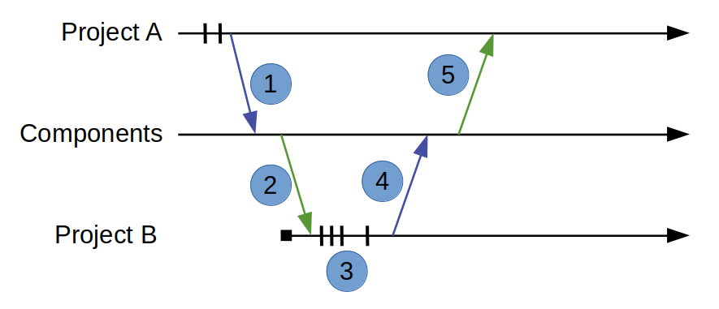

Scenario 1: Share component between projects in same repo
---------------------------------------------------------

Setup
~~~~~

In this scenario there are two projects:  Project A (PA) and Project B (PB).
PA has been in development for several months and has a stable code base.
The code has been through several Quality Control Tools (QCTs), verification and has been tested on hardware.

PB has started up and wants to re-use the rook component PA has developed.

Goals
~~~~~

#. Show how a single component can be transferred between PA and PB
#. Show how updates from PB can be fed back to PA
#. Show how this can be accomplished without merging

Workflow
~~~~~~~~

The following diagram shows the steps in this scenario:

#. Project A publishes the rook component version 1.0.0 to the component directory.
#. Project B installs version 1.0.0 of the rook component to it's project working copy.
#. Project B finds a bug and commits local changes until the bug is fixed.
#. Project B publishes version 1.1.0 of the updated rook component to the component directory.
#. Project A sees there is an update and decides to install version 1.1.0 of the rook component.

These are the commands

+------------+-------------------------------------------------------------------------+------------------------------------------------+
| Task       |  Project A                                                              | Project B                                      |
+------------+-------------------------------------------------------------------------+------------------------------------------------+
| PA         |  hcm publish rook 1.0.0 --url $REPO_URL/components -f release_notes.txt |                                                |
| Publishes  |                                                                         |                                                |
| rook       |                                                                         |                                                |
+------------+-------------------------------------------------------------------------+------------------------------------------------+
| PB         |                                                                         | hcm install rook                               |
| installs   |                                                                         |                                                |
| rook       |                                                                         | svn ci rook -m "Installing rook version 1.0.0" |
+------------+-------------------------------------------------------------------------+------------------------------------------------+
| PB fixes   |                                                                         | vim rook/rtl/rook.vhd                          |
| bug        |                                                                         |                                                |
|            |                                                                         | svn ci rook -m "Fixed bug."                    |
+------------+-------------------------------------------------------------------------+------------------------------------------------+
| PB         |                                                                         | hcm publish rook 1.1.0 -f release_notes.txt    |
| publishes  |                                                                         |                                                |
| rook       |                                                                         |                                                |
+------------+-------------------------------------------------------------------------+------------------------------------------------+
| PA looks   | hcm list                                                                |                                                |
| for        |                                                                         |                                                |
| updates    | hcm show rook --upgrades                                                |                                                |
+------------+-------------------------------------------------------------------------+------------------------------------------------+
| PA         | hcm install rook                                                        |                                                |
| installs   |                                                                         |                                                |
| rook       | svn ci rook -m "Installing rook version 1.1.0"                          |                                                |
+------------+-------------------------------------------------------------------------+------------------------------------------------+

