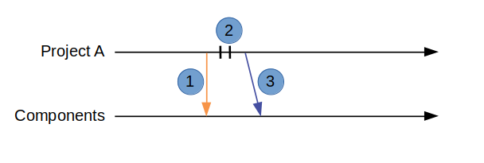

Scenario 2: Project needs to make an update but does not want to use a newer version
------------------------------------------------------------------------------------

Setup
~~~~~

In this scenario Project A (PA) is getting ready to release code to production.
PA is at version 1.0.0 of the rook component.
PA has to make some minor changes to the rook component.
PA checks for any updates to the rook component and finds a version 1.1.0.
Due to the phase of the program, PA does not want to bring in the changes for version 1.1.0.

Goals
~~~~~

#. Show how Project A can still make local changes
#. Show how Project A can publish without affecting 1.1.0

Workflow
~~~~~~~~

The following diagram shows the steps in this scenario:

#. Project A checks for updates to the rook component
#. Project A makes and commits changes locally
#. Project A publishes version 1.0.1 of the updated rook component to the component directory.

These are the commands

+------------+----------------------------------------------------+
| Task       |  Project A                                         |
+------------+----------------------------------------------------+
| PA looks   | hcm list                                           |
| for        |                                                    |
| updates    | hcm show rook --upgrades                           |
+------------+----------------------------------------------------+
| PA makes   | vim rook/rtl/rook.vhd                              |
| changes    |                                                    |
|            | svn ci rook -m "Added header."                     |
+------------+----------------------------------------------------+
| PA         |  hcm publish rook 1.0.1 -f release_notes.txt       |
| Publishes  |                                                    |
| rook       |                                                    |
+------------+----------------------------------------------------+

