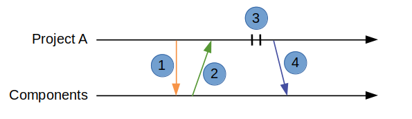

Scenario 3: Project needs to make an update but sees an upgraded version
------------------------------------------------------------------------

Setup
~~~~~

In this scenario Project A (PA) wants to make a change to a component.
PA is at version 1.0.0 of the rook component.
PA has to make some changes to the rook component.
PA checks for any updates to the rook component and finds a version 1.0.1.
PA wants to include changes from 1.0.1.

Goals
~~~~~

#. Show how Project A can make changes to an upgraded version of a component
#. Show how Project A can make changes available to other projects

Workflow
~~~~~~~~

The following diagram shows the steps in this scenario:

#. Project A checks for updates to the rook component
#. Project A installs version 1.0.1
#. Project A makes and commits changes locally
#. Project A publishes version 1.1.0 of the updated rook component to the component directory.
#. Project A installs published version

These are the commands

+------------+----------------------------------------------------+
| Task       |  Project A                                         |
+------------+----------------------------------------------------+
| PA looks   | hcm list                                           |
| for        |                                                    |
| updates    | hcm show rook --upgrades                           |
+------------+----------------------------------------------------+
| PA         | hcm install rook                                   |
| installs   |                                                    |
| rook       | svn ci rook -m "Installing rook version 1.0.1"     |
+------------+----------------------------------------------------+
| PA makes   | vim rook/rtl/rook.vhd                              |
| changes    |                                                    |
|            | svn ci rook -m "Fixing bug with movement."         |
+------------+----------------------------------------------------+
| PA         |  hcm publish rook 1.1.0 -f release_notes.txt       |
| Publishes  |                                                    |
| rook       |  hcm install rook 1.1.0 --force                    |
|            |                                                    |
|            |  svn ci rook -m "Installing rook version 1.1.0"    |
+------------+----------------------------------------------------+
| PA         | hcm install rook                                   |
| installs   |                                                    |
| rook       | svn ci rook -m "Installing rook version 1.1.0"     |
+------------+----------------------------------------------------+

