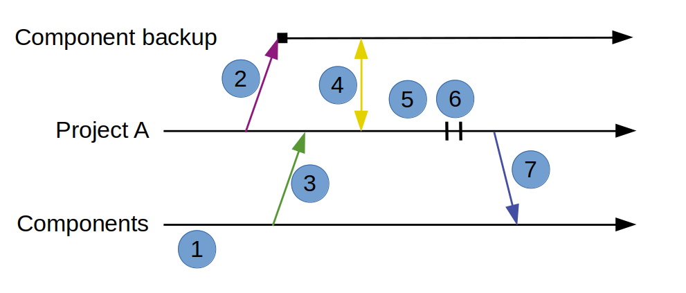

Scenario 4: Bringing in a component from a long lived branch
------------------------------------------------------------

Setup
~~~~~

In this scenario Project A (PA) has a component it has modified on it's own branch.

* The component is not under HCM control.
* There is a similar component that is under HCM control.
* The published version of the component is 1.1.0
* PA wants to merge their changes with what is published.

Goals
~~~~~

#. Show how Project A can merge their changes with the published version.
#. Show how Project A can make changes available to other projects
#. Show how Project A can start to use HCM to control the component

Workflow
~~~~~~~~

The following diagram shows the steps in this scenario:

#. Project A checks the repository for the component
#. Project A copies the existing component directory to a backup
#. Project A installs the latest version of the component
#. Project A compares the contents of the backup and installed version
#. Project A merges the changes from the backup to the installed version manually
#. Project A commits changes locally
#. Project A publishes version 1.2.0 of the updated component to the component directory.

These are the commands

+------------+----------------------------------------------------+
| Task       |  Project A                                         |
+------------+----------------------------------------------------+
| PA checks  | Use a repo browser or a web browser to check       |
| repository | what version of the component is installed.        |
|            |                                                    |
+------------+----------------------------------------------------+
| PA makes   | cp -r rook rook_backup                             |
| backup     |                                                    |
| component  |                                                    |
+------------+----------------------------------------------------+
| PA         | hcm install rook                                   |
| installs   |                                                    |
| component  | svn ci rook -m "Installing version 1.1.0 of rook"  |
+------------+----------------------------------------------------+
| PA         | Using a tool specifically made for comparing       |
| compares   | directories will help.                             |
| backup to  |                                                    |
| installed  |                                                    |
| component  |                                                    |
+------------+----------------------------------------------------+
| PA         | Move, add, modify, and/or delete files as          |
| merges     | necessary to change the installed version to the   |
| backup and | version you want to publish.                       |
| installed  |                                                    |
| component  |                                                    |
+------------+----------------------------------------------------+
| PA         | svn ci rook -m "Merged rook with version 1.1.0 of  |
| commits    | "rook"                                             |
| merged     |                                                    |
| component  |                                                    |
+------------+----------------------------------------------------+
| PA         | hcm publish rook 1.2.0 -f release_notes.txt        |
| publishes  |                                                    |
| merged     |                                                    |
| component  |                                                    |
+------------+----------------------------------------------------+

