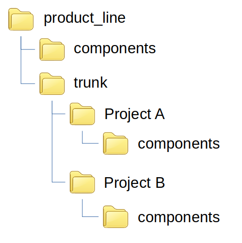

Scenarios
=========

This section will cover various sitiations and how to handle them with HCM.
Each scenario is assuming the repository structure shown below:

* The repository represent a product line
* The components directory is at the base of the repository

  * This is where components between products will be shared

* There are two projects under the trunk directory
* Under each project is a components directory

  * This is where components will be developed

.. include:: scenario_1.rst
.. include:: scenario_2.rst
