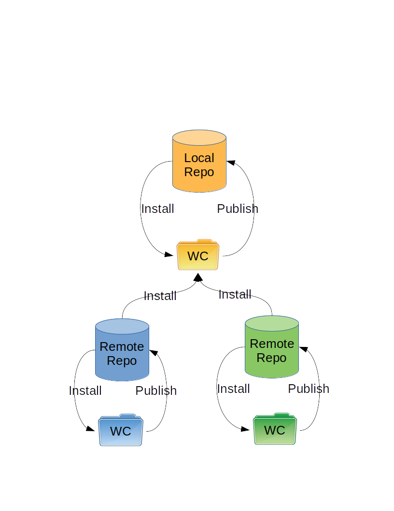

Theory of Operation
===================

HCM can create the component directory structure and place it in your repository.
This top level directory can be anywhere.
The directory structure contains individual directories for each component.
It is commonly placed either at the root or under the tags directory.

Component Directory Structure
-----------------------------

Under each component directory are releases.
Each release follows the form of a three dot number: <Major>.<Minor>.<Patch>

.. code-block:: bash

   components
   |
   +-- I2C_CONTROL
   |   |
   |   +-- 1.0.0
   |   +-- 1.1.0
   |   +-- 2.0.0
   |
   +-- SPI_MASTER_CONTROL
   |   |
   |   +-- 1.0.0
   |   +-- 2.0.0
   |   +-- 2.1.0
   |   +-- 3.0.0
   |
   +-- SPI_SLAVE_CONTROL
       |
       +-- 1.0.0
       +-- 2.0.0
       +-- 2.1.0
       +-- 3.0.0

Repository Considerations
-------------------------

.. WARNING:: There is a lot of rambling in this section.
   Refer to the conclusions if you want to skip it.

A component directory can be in number of SVN repositories.

SVN copies only work within a single repository.
Installing from multiple repositories is easy.
Publishing to an arbitrary repository is more difficult.
How do you keep track of history between publishes.
Or do you keep track?

To publish to an external repo you would need to follow these steps:

1.  Ensure all files in a component to be published directory are committed.

    a.  Any unversioned files must be deleted
    b.  it must come back with a clean status

2.  checkout component location with the --depth empty argument to the directory named .hcm_temp
3.  create the version directory
4.  copy all files recursively from the component directory in the working copy
5.  generate the hcm.json or hcm.yaml file
6.  commit the .hcm_temp directory
7.  delete the .hcm_temp directory

To publish within the same repo:

1.  Ensure all files in a component to be published directory are committed.

    a.  Any unversioned files must be deleted
    b.  it must come back with a clean status

2.  generate the hcm.json or hcm.yaml file
3.  Add/Modify hcm.json or hcm.yaml file to the component directory
4.  svn copy the local component directory to the published directory under the correct version

There are significantly less steps to publish to the internal repo than an external one.

Other considerations include ownership of the development.
Ownership typically follows the SVN repository.
It makes sense to publish within your own repository.
A component that is created as part of a project could be moved to a central location if the component is deemed worthy of being propagated.
Development at that point would cease on the local repo, and move to the external repo.

Interestingly, any install from a repo outside your own will have to be an export then commit:

1.  Delete component directory in working copy
2.  Export component from external repo
3.  Commit component

This would be different from your own repo:

1.  Delete component directory in working copy
2.  SVN copy component from internal repo
3.  Commit component

So what are the pros and cons to following the different install methods:

with the copy you keep the history, with the export you lose the history.
The export is the only option for an external repo.

Development happens within a repo, but could be published to an external repo.
We would have to keep track of the source of the publish so we can trace it back to the development.
Or do we only publish to the internal repo?
That could unneccessarily restrict access to components if there are access restrictions on the internal repo.

Conclusion:

1.  Start with supporting only publishing to local repository

    a.  Warning if attempting to publish to an external one

2.  Start with supporting only installing from local repository
3.  Then support installing from external repository (if required)
4.  Then support publishing to an external repository (if required)

