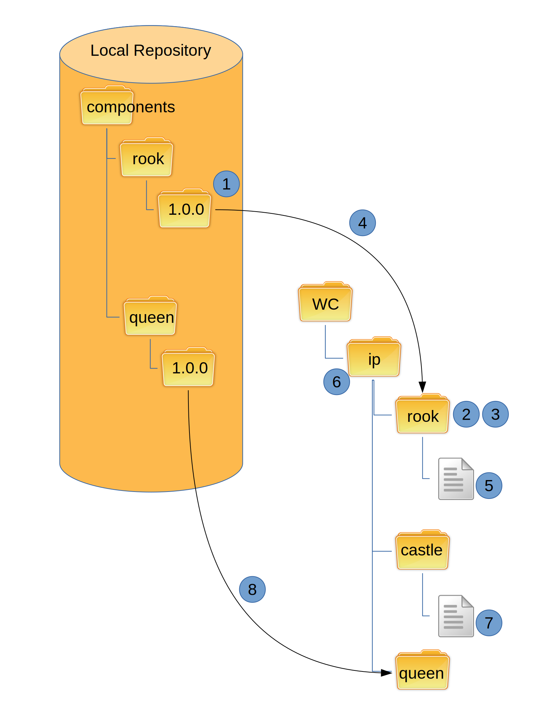

Dependencies
------------

Dependencies between components can be indicated using a file named *dependencies.yaml*.
This file is generated by hand by the user.
This is an example dependency file for the **rook** component:

.. code-block:: yaml

   requires:
     queen:
     king:
     castle: 

When **rook** is installed, HCM will also install **queen**, **king**, and **castle** if they are not already installed.

Install with dependencies
~~~~~~~~~~~~~~~~~~~~~~~~~

This is the workflow for a local install:

#.  Check if component version exists in repo
#.  Check if local component directory is svn status clean
#.  Delete component directory in working copy
#.  SVN copy component version directory from local repo
#.  Read dependencies.yaml file
#.  Check if components in YAML file have been installed
#.  Read dependencies.yaml file for those components that have been installed
#.  Install components that have not been installed

This process repeats until all dependencies have been installed.
Any duplicate dependencies are ignored.
All circular dependencies are broken.

.. NOTE:: HCM will install the latest version of a component when it is listed as a dependency.
