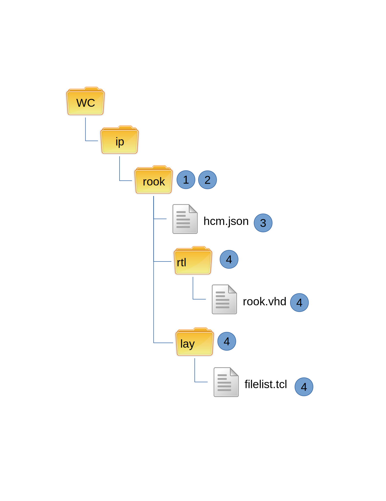

Detecting Modifications
-----------------------

Modifications to installed components is important in making several decisions:

  1)  When to publish
  2)  Whether to install

This is the workflow for checking is an installed component has modifications:

#.  Perform an **svn status** and check for uncommitted modifications
#.  Perform an **svn log -R** and parse out all the Last Changed Rev values.
#.  Extract the Last Changed Rev of the hcm.json file
#.  Compare the Last Changed Rev of every file and directory against the hcm.json file

    #.  Any file with a rev higher than hcm.json is a committed modified file.

