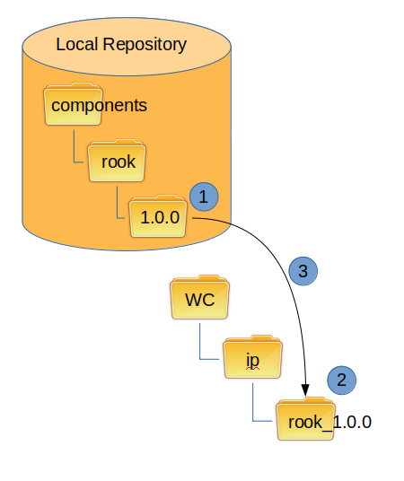

Downloading
-----------

Downloading can take place from a local repo or a remote repo.

If an install is performed from a remote repo, then the svn export command will be used.
This pulls the component from the other repo and copies it into the working copy.
The files need to be added and then committed.
History is not lost in this case, but it is a little more difficult to follow.

This is the workflow for downloading:

#.  Check if component version exists in repo
#.  Removing existing download directory if it exists
#.  Export component to using component name and version number

