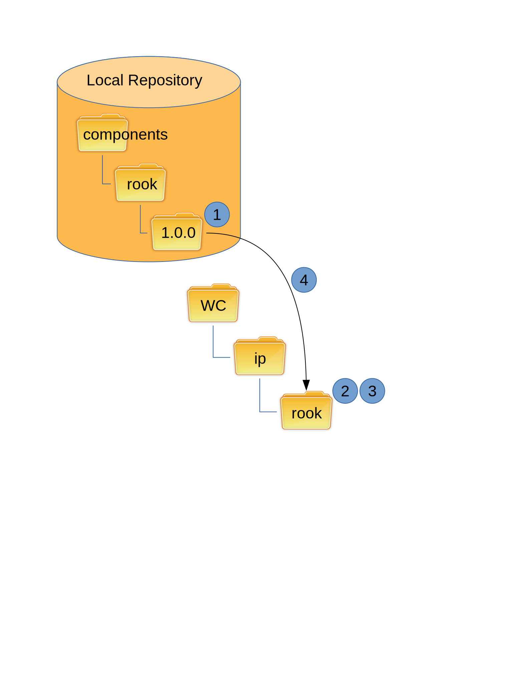
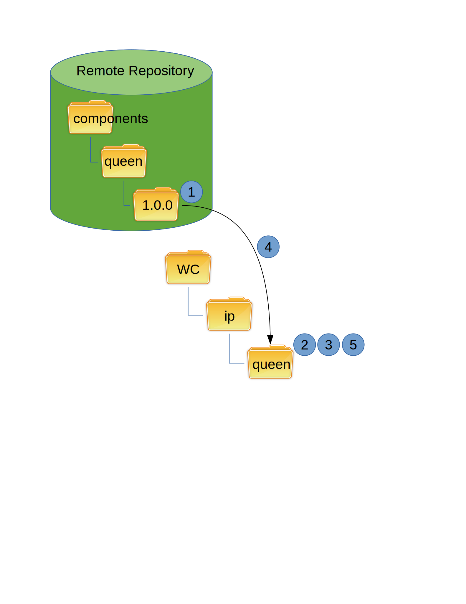
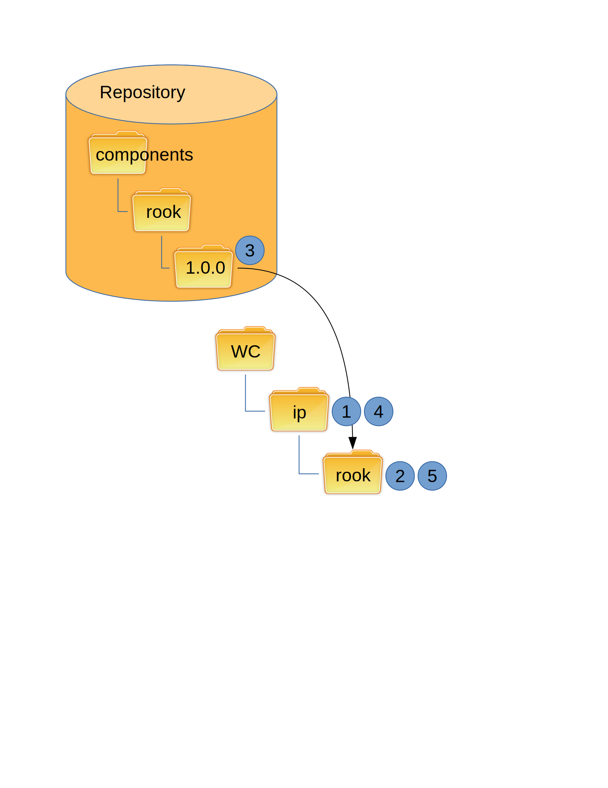

Installing
----------

Installing can take place from a local repo or a remote repo.
If an install is performed from a local repo, then the svn copy command will be used.
This provides history between what is installed and what has been published.

If an install is performed from a remote repo, then the svn export command will be used.
This pulls the component from the other repo and copies it into the working copy.
The files need to be added and then committed.
History is not lost in this case, but it is a little more difficult to follow.

Local Install
~~~~~~~~~~~~~

This is the workflow for a local install:

#.  Check if component version exists in repo
#.  Check if local component directory is svn status clean
#.  Delete component directory in working copy
#.  SVN copy component version directory from local repo

HCM will perform all these steps.

.. NOTE:: Committing the install is the responsibility of the user.

Remote Install
~~~~~~~~~~~~~~

This is the workflow for a remote install:

#.  Check if component version exists in repo
#.  Check if local component directory is svn status clean
#.  Delete component directory in working copy
#.  Export component from external repo
#.  Add exported component to working copy

HCM will perform all these steps.

.. NOTE:: Committing the install is the responsibility of the user.

External Install
~~~~~~~~~~~~~~~~

A component can be installed using an external instead of an svn copy or export.
When using an external, the type of repo (external or local) does not matter.

This is the workflow for an external install:

#.  Read externals from svn:externals property on current directory
#.  Check the status of the local component directory
#.  Check if component version exists in repo
#.  Update svn:externals property with new component version
#.  Update component directory

