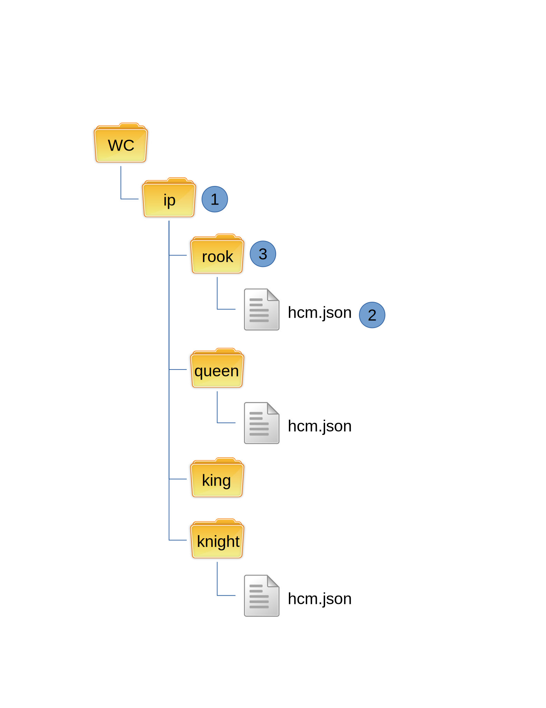

Listing
-------

Listing checks the versions of the components currently installed.

The workflow for listing is shown below:

#.  Get a listing of all directories
#.  Read version from each hcm.json file

The information is then displayed for the user.
