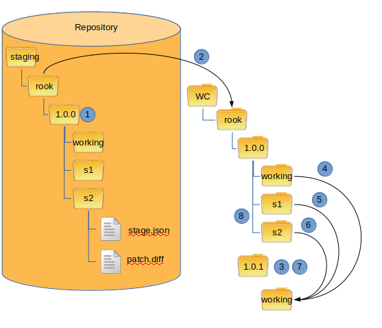

Merging Staged Updates
----------------------

.. NOTE:: This is still under development.

This is the second step in the Staging-Release method of publishing components.
At this step, there are one or more updates to an existing version of a component.
These updates must be vetted and any desired updates incorporated into a new version.

Given the nature of the effort, this step is entirely manual.
HCM can not help at this step.

The following diagram shows the steps necessary to stage a component:

1.  ??? Forgot what this step was.  I don't think it was a lock.

2.  Check out component that has staged updates

3.  Review staged updates and svn add a new version directory based on the updates

4.  svn copy the working directory on the current version

5.  Apply the first patch to the new working directory and review the results.

6.  Apply the successive patches to the new working directory and review the results.

7.  Commit final updates to the new version

8.  svn delete the stages that were incorporated

.. NOTE:: This is still under development
