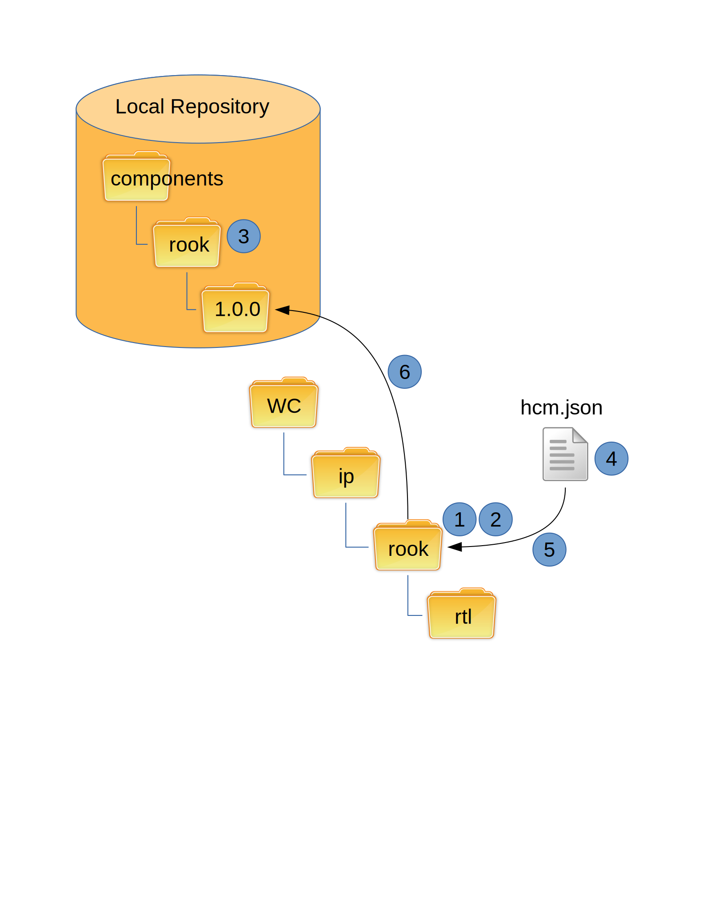

Publishing
----------

Publishing uses the svn copy command to take snapshots of a component.
The command can only work within a repository.

In the diagram above, you can see all the publish actions take place between a repository and it's respective working copy.

To publish manually you would follow these steps:

1.  Ensure requested component directory exists

2.  Validate all files in a component to be published directory are committed.

    a.  Any unversioned files must be deleted
    b.  it must come back with a clean status

3.  Create individual component directory in component directory if it does not exist.

4.  Generate the hcm.json file if it does not exist

    a.  Read hcm.json file it is does exist
    b.  Update version and manifest fields

5.  Add hcm.json file to the component directory

6.  svn copy the local component directory to the published directory under the correct version

HCM will validate step 2 has been completed before performing steps 3 through 6.

.. NOTE:: The hcm.json file has either been created or modified.
   HCM does not commit the file to the local component directory.
