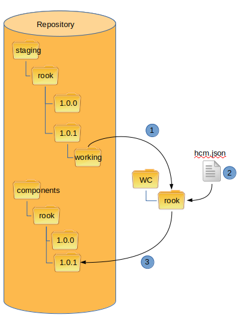

Releasing Staged Component
--------------------------

.. NOTE:: This is still under development.

This is the final step in the Staging-Release method of publishing components.
At this step, all updates for a component version have been merged.
The component is now ready to be released.

The following diagram shows the steps necessary to stage a component:

1.  Check out staged component version to be released.

2.  Update hcm.json file

3.  Publish component to the new version directory

.. NOTE:: This is still under development
