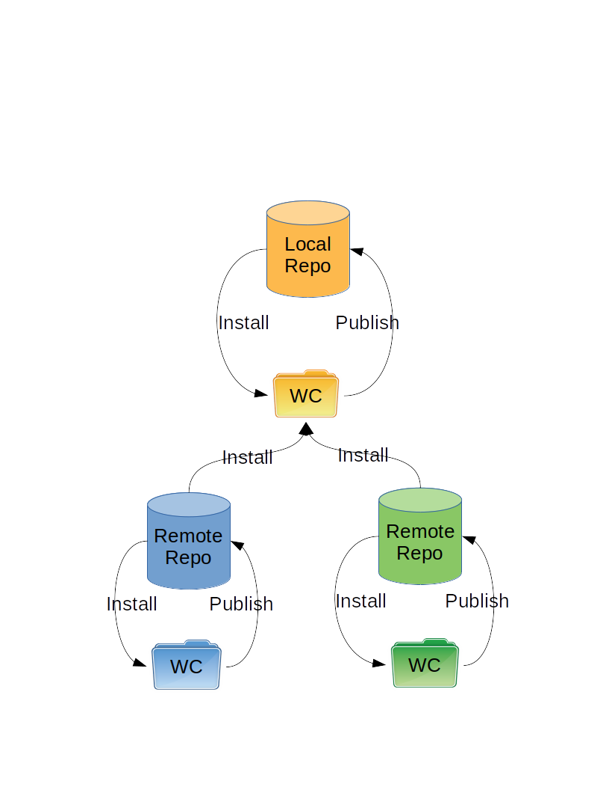

Repository Considerations
-------------------------

HCM makes several assumptions about the workflow with regards to repositories.
The diagram below shows the workflow assuming there are three repositories.

The workflow makes these assumptions:

#. Publishing is restricted to within the local repo.
#. Installing can be performed from either a local or remote repo.

Ownership Considerations
~~~~~~~~~~~~~~~~~~~~~~~~

Components should only be developed and published in a single repository.
This ensures a single source of truth for the component.

In the diagram above:

* Code in the yellow repository is developed using the yellow working copy.
* Code in the blue repository is developed using the blue working copy.
* Code in the green repository is developed using the green working copy.

You can not develop blue components in the yellow working copy.
Revision control tools do not handle crossing repositories well.

