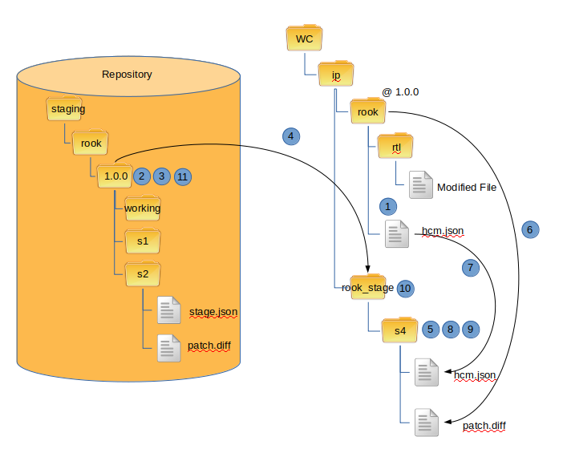

Staging
-------

.. NOTE:: This is still under development.

Staging is the first step in the Staging-Release method of publishing components.
It uses svn diffs to transfer local changes to staging area for inclusion into a future component version.
This command will work between repositories.

The following diagram shows the steps necessary to stage a component:

1.  Read hcm.json file of component

2.  Lock the version directory of the component in the staging repository

3.  Perform an svn ls command to get a list of all directories

4.  Perform svn checkout of staging version directory with the --depth empty option

5.  Create new staging directory to hold staging information

6.  Create diff of component and store under new staging directory

7.  Update hcm.json file and include staging information

8.  Add new staging directory

9.  Commit new staging directory

10.  Remove staging directory

11.  Remove lock.

.. NOTE:: This is still under development
