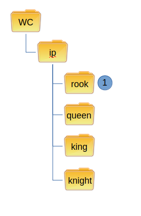
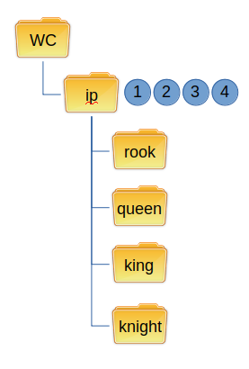

Uninstalling
------------

Uninstalling removes an installed component.
If the component was not an external install, then HCM will just use svn delete to remove the component.
If the componet was an external install, then HCM will modify the svn:externals property to remove the component.

In either case, the user is responsible for the final commit to make the uninstall official.

Normal Uninstall
~~~~~~~~~~~~~~~~

This is the workflow for a normal uninstall:

#.  SVN delete component

.. NOTE:: Committing the uninstall is the responsibility of the user.

External Uninstall
~~~~~~~~~~~~~~~~~~

Uninstalling an external requires modifying the svn:externals property of the parent directory.

This is the workflow for an external uninstall:

#.  Read externals from svn:externals property on current directory
#.  Remove component from svn:externals property
#.  Update svn:externals property with new component version
#.  Update component directory

.. NOTE:: Committing the uninstall is the responsibility of the user.
